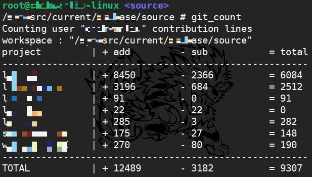

# git_count
Count all of your contribution line in all projects under workspace.

## Usage
Download a suitable "git_count" file (*mostly for_bash version*)
Go to your workspace (*directory structure : "workspace/project_1/.git"*)

excute `git_count`

## Demo

Execution (edit varieble $hide at line 4 to hide project's name)

